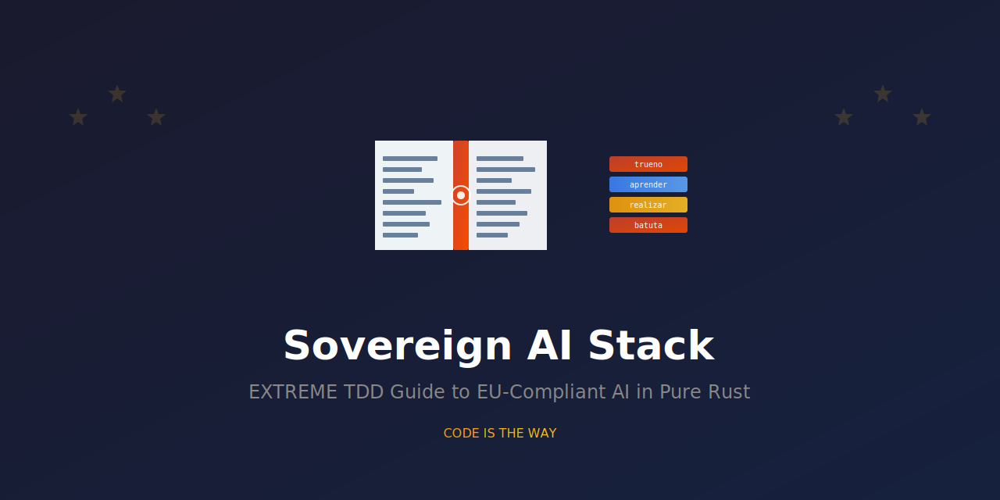
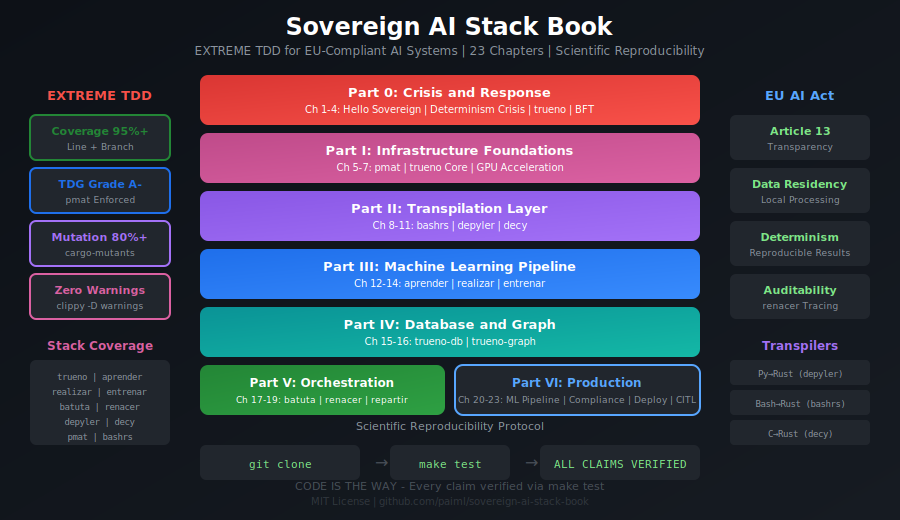

<div align="center">

<p align="center">
  
</p>

<h1 align="center">Sovereign AI Stack Book</h1>

<p align="center">
  <b>EXTREME TDD guide to building EU-compliant AI systems in pure Rust — every claim scientifically reproducible</b>
</p>

<p align="center">
  <a href="https://github.com/paiml/sovereign-ai-stack-book/actions/workflows/ci.yml"></a>
  <a href="https://paiml.github.io/sovereign-ai-stack-book/"></a>
  <a href="https://opensource.org/licenses/MIT"></a>
  <a href="https://www.rust-lang.org/"></a>
</p>

</div>

---



## Overview

This book documents the **Sovereign AI Stack**, a complete pure-Rust ecosystem for organizations requiring full control over their ML infrastructure. Every claim is verified through working code examples that readers can execute locally.

### Key Capabilities

- **Scientific Reproducibility**: `git clone` → `make test` → all claims verified
- **EXTREME TDD**: 95%+ coverage, A- TDG grade, 80%+ mutation score
- **EU AI Act Compliance**: Articles 10, 13, 15 addressed with auditable code
- **Zero Vaporware**: Every example compiles, tests pass, benchmarks run
- **Brutal Honesty**: Shows failures (GPU 65x slower) not just successes

## Quick Start

```bash
# Clone and verify
git clone https://github.com/paiml/sovereign-ai-stack-book.git
cd sovereign-ai-stack-book

# Scientific reproducibility protocol
make test              # All examples compile and pass
make bench             # Reproduce performance claims
make validate          # Coverage, TDG, clippy checks

# Read the book
mdbook serve --open    # http://localhost:3000
```

**If `make test` passes, the book's claims are true. If not, [file an issue](https://github.com/paiml/sovereign-ai-stack-book/issues).**

## Installation

### Prerequisites

- **Rust 1.75+**: Install via [rustup](https://rustup.rs/)
- **cargo-nextest**: Fast test runner (optional but recommended)
- **mdBook**: For building/viewing the book locally

### Setup

```bash
# Install Rust (if not already installed)
curl --proto '=https' --tlsv1.2 -sSf https://sh.rustup.rs | sh
source ~/.cargo/env

# Install dependencies
make setup

# Or install manually:
cargo install cargo-nextest --locked
cargo install mdbook --locked
cargo install cargo-tarpaulin --locked  # Optional: coverage
```

### Verify Installation

```bash
# Check Rust version
rustc --version  # Should be 1.75.0 or higher

# Verify workspace builds
cargo check --workspace

# Run tests
make test
```

### Platform Support

| Platform | Status | Notes |
|----------|--------|-------|
| Linux x86_64 | ✅ Full | Primary development platform |
| macOS ARM64 | ✅ Full | M1/M2/M3 supported |
| macOS x86_64 | ✅ Full | Intel Macs supported |
| Windows x86_64 | ✅ Full | MSVC toolchain required |

## Book Structure

The book covers 23 chapters across 6 parts:

```
┌─────────────────────────────────────────────────────────────┐
│              Part 0: Crisis and Response                    │
│        Ch 1-4: Sovereign AI | Determinism | trueno | BFT    │
├─────────────────────────────────────────────────────────────┤
│            Part I: Infrastructure Foundations               │
│              Ch 5-7: pmat | trueno Core | GPU               │
├─────────────────────────────────────────────────────────────┤
│              Part II: Transpilation Layer                   │
│            Ch 8-11: bashrs | depyler | decy                 │
├─────────────────────────────────────────────────────────────┤
│            Part III: Machine Learning Pipeline              │
│           Ch 12-14: aprender | realizar | entrenar          │
├─────────────────────────────────────────────────────────────┤
│             Part IV: Database and Graph                     │
│              Ch 15-16: trueno-db | trueno-graph             │
├──────────────────────────┬──────────────────────────────────┤
│   Part V: Orchestration  │      Part VI: Production         │
│  Ch 17-19: batuta |      │  Ch 20-23: ML Pipeline |         │
│  renacer | repartir      │  Compliance | Deploy | CITL      │
└──────────────────────────┴──────────────────────────────────┘
```

## Stack Components

| Component | Description | Chapter |
|-----------|-------------|---------|
| [trueno](https://crates.io/crates/trueno) | SIMD/GPU compute primitives | Ch 3, 6-7 |
| [aprender](https://crates.io/crates/aprender) | ML algorithms: regression, trees, clustering | Ch 12 |
| [realizar](https://crates.io/crates/realizar) | Inference engine for GGUF/SafeTensors | Ch 13 |
| [entrenar](https://crates.io/crates/entrenar) | Distributed training | Ch 14 |
| [batuta](https://crates.io/crates/batuta) | Stack orchestration | Ch 17 |

### Transpilers

| Component | Description | Chapter |
|-----------|-------------|---------|
| [depyler](https://crates.io/crates/depyler) | Python to Rust transpiler | Ch 10 |
| [decy](https://crates.io/crates/decy) | TypeScript/Deno to Rust | Ch 11 |
| [bashrs](https://crates.io/crates/bashrs) | Bash to Rust transpiler | Ch 9 |

### Infrastructure

| Component | Description | Chapter |
|-----------|-------------|---------|
| [pmat](https://crates.io/crates/pmat) | Quality enforcement toolkit | Ch 5 |
| [trueno-db](https://crates.io/crates/trueno-db) | GPU-accelerated analytics | Ch 15 |
| [trueno-graph](https://crates.io/crates/trueno-graph) | Graph analytics | Ch 16 |
| [renacer](https://crates.io/crates/renacer) | Syscall tracing | Ch 18 |
| [repartir](https://crates.io/crates/repartir) | Work-stealing scheduler | Ch 19 |

## Quality Standards

The book enforces production-grade quality on all examples:

| Metric | Requirement | Enforcement |
|--------|-------------|-------------|
| Test Coverage | 95%+ | `cargo tarpaulin` |
| TDG Grade | A- (90+) | `pmat tdg` |
| Mutation Score | 80%+ | `cargo mutants` |
| Warnings | Zero | `clippy -D warnings` |

```bash
# Run full quality validation
make validate
```

## Design Principles

The book applies Toyota Production System principles:

| Principle | Application |
|-----------|-------------|
| **Jidoka** | Compiler stops on defects (Rust type system) |
| **Poka-Yoke** | Tests prevent errors before deployment |
| **Genchi Genbutsu** | Benchmarks verify claims empirically |
| **Muda** | SIMD eliminates computational waste |
| **Kaizen** | Continuous quality improvement via pmat |

## Development

```bash
# Build all examples
cargo build --workspace --all-targets

# Run tests
cargo test --workspace

# Build book
mdbook build

# Serve locally
mdbook serve --open
```

## Contributing

Contributions welcome! Please follow the PAIML quality standards:

1. Fork the repository
2. Create a feature branch
3. Ensure the book builds: `mdbook build`
4. Run tests: `mdbook test`
5. Submit a pull request

## License

MIT License — see [LICENSE](LICENSE) for details.

## Links

- [Online Book](https://paiml.github.io/sovereign-ai-stack-book/)
- [GitHub Repository](https://github.com/paiml/sovereign-ai-stack-book)
- [Pragmatic AI Labs](https://paiml.com)

---

**Sovereign AI Stack Book** — CODE IS THE WAY.
