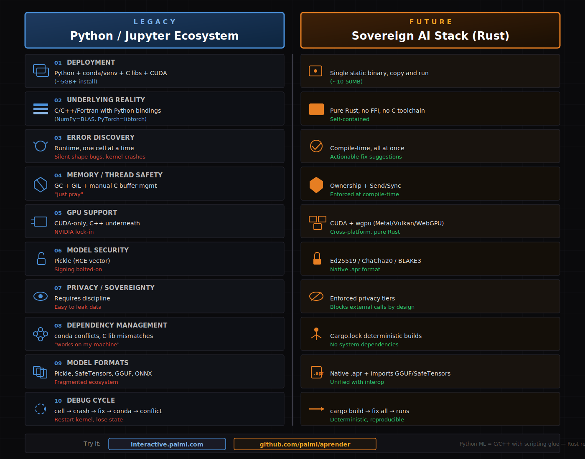

# Appendix D: PAIML Sovereign AI Ecosystem

This appendix provides a comprehensive comparison between the traditional Python/Jupyter ML ecosystem and the PAIML Sovereign AI Stack built on Rust, including migration tooling to convert existing codebases.

## Visual Overview



---

## Executive Summary

**The core insight**: Python ML is actually a C/C++/Fortran stack with scripting glue. The PAIML ecosystem replaces the entire tower with pure Rust, delivering compile-time guarantees, single-binary deployment, cryptographic sovereignty, **plus migration tooling to convert existing codebases**.

| Trade-off | Python Wins | Rust Wins |
|-----------|-------------|-----------|
| Ecosystem breadth | | ✓ Imports GGUF/SafeTensors/ONNX (500k+ HF models) |
| Deployment simplicity | | ✓ Single binary |
| Correctness guarantees | | ✓ Compile-time |
| Security by design | | ✓ Native crypto |
| Edge/airgap deployment | | ✓ Zero dependencies |
| Migration path | | ✓ Automated transpilers |
| Python ecosystem familiarity | ✓ Existing skills/code | |

---

## Complete Ecosystem Architecture

```
┌─────────────────────────────────────────────────────────────────────────┐
│                        MIGRATION LAYER                                   │
│  ┌─────────┐  ┌─────────┐  ┌─────────┐  ┌─────────┐  ┌─────────────────┐ │
│  │ depyler │  │  decy   │  │ bashrs  │  │  ruchy  │  │ New Rust-first  │ │
│  │ Py→Rust │  │  C→Rust │  │ Rust→sh │  │ Scripting│  │   Scripting    │ │
│  └─────────┘  └─────────┘  └─────────┘  └─────────┘  └─────────────────┘ │
└─────────────────────────────────────────────────────────────────────────┘
                                    │
┌─────────────────────────────────────────────────────────────────────────┐
│                        TOOLING LAYER                                     │
│  ┌──────────────────┐  ┌──────────────────┐  ┌────────────────────────┐ │
│  │  pmcp (rust-mcp) │  │      pforge      │  │         pmat           │ │
│  │  MCP Protocol    │  │  Declarative MCP │  │   Quality Analysis     │ │
│  │  16x faster      │  │  YAML→Rust MCP   │  │   TDG/Mutation/Lint    │ │
│  └──────────────────┘  └──────────────────┘  └────────────────────────┘ │
└─────────────────────────────────────────────────────────────────────────┘
                                    │
┌─────────────────────────────────────────────────────────────────────────┐
│                     SOVEREIGN AI STACK                                   │
│  ┌─────────────────────────────────────────────────────────────────────┐ │
│  │                        batuta v0.1.3                                 │ │
│  │                      Orchestration/CLI                               │ │
│  ├─────────────────────────────┬───────────────────────────────────────┤ │
│  │      realizar v0.2.2        │           pacha v0.1.1                │ │
│  │   GGUF/SafeTensor Inference │     Model Registry (Ed25519/ChaCha)   │ │
│  ├─────────────────────────────┴───────────────────────────────────────┤ │
│  │                       aprender v0.14.1                              │ │
│  │         ML Algorithms: regression, trees, clustering, .apr          │ │
│  ├─────────────────────────────────────────────────────────────────────┤ │
│  │                        trueno v0.7.4                                │ │
│  │              SIMD/GPU Compute: CUDA + wgpu (Metal/Vulkan)           │ │
│  └─────────────────────────────────────────────────────────────────────┘ │
│              Pure Rust │ No FFI │ No C deps │ Single Binary              │
└─────────────────────────────────────────────────────────────────────────┘
```

---

## Layer 1: Sovereign AI Stack (ML Infrastructure)

### Python/Jupyter Ecosystem

```
┌─────────────────────────────────────────┐
│           Python Scripts                │  ← What you write
├─────────────────────────────────────────┤
│  NumPy │ Pandas │ sklearn │ PyTorch     │  ← Python APIs
├─────────────────────────────────────────┤
│  BLAS/LAPACK │ libtorch │ cuDNN         │  ← C/C++/Fortran
├─────────────────────────────────────────┤
│           CUDA Toolkit                  │  ← NVIDIA only
└─────────────────────────────────────────┘
```

### Sovereign AI Stack (Rust)

```
┌─────────────────────────────────────────┐
│            batuta v0.1.3                │  ← Orchestration/CLI
├──────────────────┬──────────────────────┤
│  realizar v0.2.2 │    pacha v0.1.1      │  ← Inference │ Registry
├──────────────────┴──────────────────────┤
│           aprender v0.14.1              │  ← ML Algorithms
├─────────────────────────────────────────┤
│            trueno v0.7.4                │  ← SIMD/GPU Compute
└─────────────────────────────────────────┘
        Pure Rust │ No FFI │ No C deps
```

### Component Reference

| Layer | Python | Rust (Sovereign) | Function |
|-------|--------|------------------|----------|
| Compute | NumPy, CuPy, JAX | trueno | SIMD/GPU primitives |
| ML Algos | scikit-learn, XGBoost | aprender | Classical ML |
| Inference | transformers, vLLM | realizar | Model serving |
| Registry | MLflow, HuggingFace Hub | pacha | Model management |
| Orchestration | Airflow, Ray, Kubeflow | batuta | Workflow coordination |
| Data Loading | pandas, Datasets | alimentar | ETL pipelines |
| Analytics DB | DuckDB, Polars | trueno-db | GPU-accelerated queries |

### Model Import: Full HuggingFace Compatibility

**The ecosystem breadth argument is eliminated.** The Sovereign AI Stack imports all major model formats:

| Format | Source | Import Status |
|--------|--------|---------------|
| **GGUF** | llama.cpp, HuggingFace | ✓ Native via realizar |
| **SafeTensors** | HuggingFace standard | ✓ Native via realizar |
| **ONNX** | Cross-framework | ✓ Supported |
| **PyTorch** (.pt/.pth) | Convert to SafeTensors | ✓ Via conversion |

```bash
# Load any HuggingFace model
batuta pacha pull meta-llama/Llama-3-8B-Instruct-GGUF
batuta pacha pull mistralai/Mistral-7B-v0.1  # SafeTensors

# Convert and import with provenance
batuta pacha import model.safetensors --sign --encrypt
```

**Result**: Access to 500k+ HuggingFace models with single-binary deployment, no Python runtime.

---

## Layer 2: Tooling (MCP & Quality)

### pmcp (rust-mcp-sdk) — MCP Protocol Implementation

**What it is**: Production-grade Rust implementation of the Model Context Protocol (MCP), 16x faster than TypeScript.

| Feature | Specification |
|---------|---------------|
| **Performance** | 16x faster than TypeScript SDK, 50x lower memory |
| **Transports** | stdio, HTTP/SSE, WebSocket, WASM |
| **Auth** | OAuth 2.0, Bearer tokens, OIDC discovery |
| **Type Safety** | Automatic JSON schema from Rust types |
| **Quality** | Toyota Way principles, zero `unwrap()` policy |

```rust
// Type-safe MCP server example
let server = ServerBuilder::new()
    .name("weather-server")
    .tool("get-weather", TypedTool::new(...))
    .build()?;
server.run_stdio().await?;
```

**Links**: [github.com/paiml/rust-mcp-sdk](https://github.com/paiml/rust-mcp-sdk) | [crates.io/crates/pmcp](https://crates.io/crates/pmcp)

---

### pforge — Declarative MCP Framework

**What it is**: Define MCP servers in YAML instead of code. Built on pmcp.

```yaml
forge:
  name: my-server
  version: 0.1.0
  transport: stdio

tools:
  - type: native
    name: greet
    description: "Greet someone"
    handler:
      path: handlers::greet_handler
    params:
      name: { type: string, required: true }
```

| Handler Type | Description |
|--------------|-------------|
| **Native** | Rust functions with full type safety |
| **CLI** | Execute shell commands |
| **HTTP** | Proxy HTTP endpoints |
| **Pipeline** | Chain multiple tools |

**Links**: [github.com/paiml/pforge](https://github.com/paiml/pforge) | [paiml.github.io/pforge](https://paiml.github.io/pforge/)

---

### pmat — Code Quality Analysis Toolkit

**What it is**: Zero-configuration AI context generation and code quality analysis for 17+ languages.

| Capability | Description |
|------------|-------------|
| **Context Generation** | Deep analysis for Claude, GPT, LLMs |
| **Technical Debt Grading** | A+ through F scoring, 6 metrics |
| **Mutation Testing** | Test suite quality (85%+ kill rate target) |
| **Repository Scoring** | Health assessment (0-211 scale) |
| **Semantic Search** | Natural language code discovery |
| **MCP Integration** | 19 tools for AI agents |

```bash
# Generate AI-ready context
pmat context --output context.md --format llm-optimized

# Grade technical debt
pmat analyze tdg

# Run mutation testing
pmat mutate --target src/ --threshold 85
```

**Links**: [github.com/paiml/paiml-mcp-agent-toolkit](https://github.com/paiml/paiml-mcp-agent-toolkit) | [crates.io/crates/pmat](https://crates.io/crates/pmat)

---

## Layer 3: Migration Transpilers

### The Rust Migration Path

The PAIML ecosystem provides transpilers to migrate existing codebases to Rust:

```
┌─────────────────────────────────────────────────────────────────┐
│                   MIGRATION SOURCES                              │
├────────────┬────────────┬────────────┬────────────┬─────────────┤
│   Python   │     C      │   Bash     │  (New)     │    Rust     │
│  depyler   │   decy     │   bashrs   │   ruchy    │  (Target)   │
│    ↓       │     ↓      │     ↓      │     ↓      │             │
│   .py      │    .c      │    .sh     │  .ruchy    │    .rs      │
│    ↓       │     ↓      │     ↓      │     ↓      │             │
│ ══════════════════════════════════════════════════════════════  │
│                     SAFE, IDIOMATIC RUST                         │
└─────────────────────────────────────────────────────────────────┘
```

---

### depyler — Python to Rust Transpiler

**What it is**: Compiles Python to Rust with semantic verification and memory safety analysis.

| Feature | Details |
|---------|---------|
| **Single-command compile** | `depyler compile script.py` → native binary |
| **Semantic verification** | Property-based testing for equivalence |
| **Type-directed** | Uses Python annotations for Rust types |
| **27 stdlib modules** | json, datetime, hashlib, etc. (100% validated) |
| **MCP Integration** | Available as MCP server for AI assistants |

```bash
# Compile Python to standalone binary
depyler compile script.py -o myapp

# Transpile with verification
depyler transpile example.py --verify
```

**Python** (`example.py`):

```python
def fibonacci(n: int) -> int:
    if n <= 1:
        return n
    return fibonacci(n - 1) + fibonacci(n - 2)
```

**Rust** (generated):

```rust
fn fibonacci(n: i32) -> i32 {
    if n <= 1 {
        return n;
    }
    fibonacci(n - 1) + fibonacci(n - 2)
}
```

**Links**: [github.com/paiml/depyler](https://github.com/paiml/depyler) | [crates.io/crates/depyler](https://crates.io/crates/depyler)

---

### decy — C to Rust Transpiler

**What it is**: Transpiles legacy C to safe, idiomatic Rust with minimal `unsafe` blocks.

| Feature | Details |
|---------|---------|
| **Ownership inference** | Converts pointers to `&T`, `&mut T`, `Box`, `Vec` |
| **Lifetime inference** | Automatic lifetime annotation |
| **Unsafe minimization** | 4-phase reduction: 100% → <5% unsafe |
| **Project-level** | `decy transpile-project src/` with caching |
| **Target projects** | CPython, Git, SQLite, NumPy |

```bash
# Transpile single file
decy transpile input.c -o output.rs

# Transpile entire project
decy transpile-project src/ -o rust_output/

# Debug transpilation
decy debug --visualize-ownership input.c
```

**Unsafe Reduction Pipeline**:

1. **Phase 1**: Pattern-based (100% → 50%) — malloc/free → Box
2. **Phase 2**: Ownership inference (50% → 20%) — &T, &mut T
3. **Phase 3**: Lifetime inference (20% → 10%)
4. **Phase 4**: Safe wrappers (10% → <5%)

**Links**: [github.com/paiml/decy](https://github.com/paiml/decy)

---

### bashrs (rash) — Bidirectional Shell Safety Tool

**What it is**: Write shell scripts in Rust with automatic safety, OR purify legacy bash.

| Direction | Description |
|-----------|-------------|
| **Rust → Shell** | Write safe shell scripts in Rust syntax |
| **Bash → Safe Shell** | Purify messy bash to deterministic POSIX |

**Automatic Safety Guarantees**:

- Shell injection protection
- Word splitting prevention
- Glob expansion safety
- Idempotent operations

```bash
# Transpile Rust to shell
bashrs build install.rs -o install.sh

# Purify legacy bash
bashrs purify messy.sh -o clean.sh

# Lint shell scripts
bashrs lint script.sh
```

**Before** (messy bash):

```bash
SESSION_ID=$RANDOM                      # Non-deterministic
mkdir /app/releases/$RELEASE            # Non-idempotent
```

**After** (purified):

```bash
session_id="session-${version}"         # Deterministic
mkdir -p "/app/releases/${release}"     # Idempotent
```

**Links**: [github.com/paiml/bashrs](https://github.com/paiml/bashrs) | [crates.io/crates/bashrs](https://crates.io/crates/bashrs)

---

### ruchy — Rust-First Scripting Language

**What it is**: Modern scripting language that transpiles to Rust. Python expressiveness + Rust safety.

| Feature | Details |
|---------|---------|
| **Self-hosting compiler** | Written in Rust, full bootstrapping |
| **Interactive REPL** | Syntax highlighting, completion |
| **WASM support** | Browser and edge deployment |
| **Notebook integration** | Jupyter-style with testing |
| **DataFrame support** | 80% complete, 200K+ property tests |
| **Zero unsafe** | All generated code is thread-safe |

```ruchy
// Variables and functions
let x = 42
let name = "Ruchy"
println(f"Hello, {name}!")

fun add(a, b) {
    a + b
}

// Pattern matching
match value {
    Some(x) => println(f"Got {x}"),
    None => println("Nothing"),
}
```

```bash
# Interactive REPL
ruchy

# Run script
ruchy script.ruchy

# Compile to binary
ruchy compile script.ruchy -o myapp

# Package management (Cargo integration)
ruchy new my_project
ruchy add serde tokio
```

**Links**: [github.com/paiml/ruchy](https://github.com/paiml/ruchy) | [crates.io/crates/ruchy](https://crates.io/crates/ruchy)

---

## The 10-Point Comparison (Python vs Rust)

### 1. Deployment

| Python | Rust |
|--------|------|
| Python runtime (~100MB) | Single static binary |
| conda/venv environment | (~10-50MB total) |
| pip dependencies (GB+ for ML) | No runtime needed |
| CUDA toolkit (~4GB) | Copy file, execute |
| cuDNN (~800MB) | |
| Dockerfile to wrangle it all | |

**Bottom line**: ~5GB+ install vs ~50MB binary.

---

### 2. Underlying Reality

| Python | Rust |
|--------|------|
| NumPy = BLAS/LAPACK (Fortran) | Pure Rust throughout |
| PyTorch = libtorch (C++) | No FFI boundaries |
| TensorFlow = C++ core | No C toolchain required |
| Python is the glue, not the engine | Self-contained |

**Bottom line**: You're not really writing Python ML—you're configuring C++.

---

### 3. Error Discovery

| Python/Jupyter | Rust |
|----------------|------|
| Runtime errors | Compile-time errors |
| One cell at a time | All errors at once |
| Silent shape mismatches | Type-checked dimensions |
| Stack trace dumps | Actionable fix suggestions |
| Kernel crashes lose state | Build fails safely |

**Example**:

```python
# Python: runs, produces wrong result silently
result = model.predict(X.T)  # Oops, transposed
```

```rust
// Rust: compile error with fix suggestion
error[E0308]: mismatched types
  --> src/main.rs:12:18
   |
12 |     model.predict(&x)?;
   |                   ^^ expected `Matrix<100, 10>`, found `Matrix<10, 100>`
   |
help: consider using `x.transpose()`
```

---

### 4. Memory & Thread Safety

| Python | Rust |
|--------|------|
| Garbage collector | Ownership system |
| Global Interpreter Lock (GIL) | `Send + Sync` traits |
| Manual C buffer management | Compile-time enforcement |
| Data races possible | Data races impossible |
| "just pray" | Zero-cost abstractions |

**Bottom line**: Rust eliminates entire categories of bugs at compile time.

---

### 5. GPU Support

| Python | Rust |
|--------|------|
| CUDA only | CUDA (when available) |
| NVIDIA hardware lock-in | wgpu backend |
| C++ underneath | Metal (Apple) |
| Complex driver dependencies | Vulkan (cross-platform) |
| | WebGPU (browser) |
| | Pure Rust implementation |

**Bottom line**: Rust gives you CUDA performance where available, portable fallbacks elsewhere.

---

### 6. Model Security

| Python | Rust |
|--------|------|
| Pickle (arbitrary code execution) | Ed25519 digital signatures |
| Signing is afterthought | ChaCha20-Poly1305 encryption |
| Trust-on-download | BLAKE3 content addressing |
| No provenance chain | Native `.apr` format |
| | Cryptographic lineage |

**Security primitives in `.apr` format**:

- AES-256-GCM encryption at rest
- Ed25519 signatures for authenticity
- X25519 key exchange for distribution
- CRC32 checksums for integrity
- License blocks and watermarking

---

### 7. Privacy & Sovereignty

| Python | Rust |
|--------|------|
| Requires discipline | Enforced by design |
| Easy to accidentally leak | Privacy tiers block calls |
| No built-in controls | Configurable per-deployment |

**Privacy Tiers**:

| Tier | Behavior | Use Case |
|------|----------|----------|
| **Sovereign** | Blocks ALL external APIs | Healthcare, Government |
| **Private** | VPC/dedicated endpoints only | Financial services |
| **Standard** | Public APIs allowed | General deployment |

```rust
let selector = BackendSelector::new()
    .with_privacy(PrivacyTier::Sovereign);
// Only returns: Realizar, Ollama, LlamaCpp (local)
```

---

### 8. Dependency Management

| Python | Rust |
|--------|------|
| conda environment conflicts | Cargo.lock deterministic |
| C library version mismatches | Reproducible builds |
| "works on my machine" | No system dependencies |
| Diamond dependency hell | Semantic versioning enforced |
| Rebuild env from scratch regularly | Build once, run anywhere |

**Python nightmare**:

```bash
$ conda install pytorch
Solving environment: failed
Conflict: libstdc++ 11.2 vs 12.1
```

**Rust reality**:

```bash
$ cargo build --release
   Compiling aprender v0.14.1
    Finished release [optimized] target(s) in 45.32s
```

---

### 9. Model Formats

| Python | Rust |
|--------|------|
| Pickle (unsafe, Python-only) | Native `.apr` format |
| SafeTensors | **Imports SafeTensors** ✓ |
| GGUF | **Imports GGUF** ✓ |
| ONNX | **Imports ONNX** ✓ |
| Fragmented, incompatible | **Universal import + unified native format** |

**Key insight**: The Sovereign AI Stack can load **any model from HuggingFace** via GGUF/SafeTensors import. You get access to 500k+ models WITHOUT the Python runtime.

**`.apr` format capabilities**:

- Memory-mapped loading (600x faster)
- Zero-copy deserialization
- Built-in Ed25519 signing & ChaCha20 encryption
- Compression (zstd)
- Commercial licensing blocks
- Buyer-specific watermarking

---

### 10. Debug Cycle

| Python/Jupyter | Rust |
|----------------|------|
| Run cell | `cargo build` |
| Crash | See all errors |
| Fix one error | Fix all errors |
| Run cell | `cargo build` |
| Different crash | Runs correctly |
| Fix again | |
| conda update breaks something | |
| Nuke environment | |
| Rebuild from scratch | |
| Maybe works now | |

**Typical Python session**:

```
Cell 1: ✓
Cell 2: ✓
Cell 3: TypeError
Cell 4: Fixed → ✓
Cell 5: OOM, kernel died
Cell 6: Restart, re-run all, different error
Cell 7: Works locally, fails in prod
```

**Typical Rust session**:

```
$ cargo build
error[E0308]: 3 errors
$ # fix all three
$ cargo build
    Finished
$ ./target/release/myapp
# Works. Same binary works everywhere.
```

---

## Correctness Tooling Comparison

| Tool Type | Python | Rust |
|-----------|--------|------|
| Linting | pylint, flake8 | clippy (built-in) |
| Type checking | mypy (optional, incomplete) | Compiler (mandatory, complete) |
| Property testing | hypothesis | proptest |
| Fuzz testing | atheris | cargo-fuzz |
| Mutation testing | mutmut | cargo-mutants |
| Memory checking | valgrind (external) | miri (built-in) |
| Thread sanitizer | external tools | Compiler prevents races |

---

## Edge/Airgap Deployment

### Python

```bash
# Package everything
docker build -t ml-app .  # 4GB+ image
docker save ml-app > ml-app.tar
# Transfer 4GB to airgapped system
docker load < ml-app.tar
docker run ml-app
# Hope all dependencies resolve
```

### Rust

```bash
cargo build --release --target x86_64-unknown-linux-musl
# Transfer 50MB binary
scp target/release/ml-app airgapped-host:
ssh airgapped-host ./ml-app
# Done. No runtime. No dependencies.
```

---

## Complete Ecosystem Reference

### ML Infrastructure (Sovereign AI Stack)

| Component | Version | Function | Replaces |
|-----------|---------|----------|----------|
| **trueno** | 0.7.4 | SIMD/GPU compute | NumPy, CuPy |
| **aprender** | 0.14.1 | ML algorithms, .apr format | scikit-learn |
| **realizar** | 0.2.2 | GGUF/SafeTensor inference | transformers |
| **pacha** | 0.1.1 | Model registry (Ed25519/ChaCha) | MLflow, HF Hub |
| **batuta** | 0.1.3 | Orchestration/CLI | Airflow, Ray |
| **alimentar** | - | Data loading/ETL | pandas, Datasets |
| **trueno-db** | - | GPU analytics | DuckDB |
| **trueno-graph** | - | Code analysis | - |
| **renacer** | - | Syscall tracing | strace |

### MCP & Tooling

| Component | Function | Key Feature |
|-----------|----------|-------------|
| **pmcp** | MCP protocol SDK | 16x faster than TypeScript |
| **pforge** | Declarative MCP framework | YAML → Rust MCP servers |
| **pmat** | Code quality analysis | TDG scoring, mutation testing |

### Migration Transpilers

| Component | Direction | Key Feature |
|-----------|-----------|-------------|
| **depyler** | Python → Rust | Semantic verification, 27 stdlib modules |
| **decy** | C → Rust | Ownership inference, <5% unsafe |
| **bashrs** | Rust → Shell / Bash → Safe Shell | Bidirectional, deterministic |
| **ruchy** | Ruchy → Rust | New scripting language, WASM |

---

## When to Choose Each

### Choose Python/Jupyter When:

- Rapid prototyping and exploration (notebook UX)
- Team already fluent in Python (existing skills)
- Research/experimentation phase (quick iteration)
- Using Python-only libraries with no Rust equivalent

### Choose PAIML Ecosystem When:

- Production deployment at scale
- Edge/embedded/airgapped environments
- Regulatory compliance (healthcare, finance, government)
- Security and provenance are mandatory
- Deployment simplicity is priority
- Long-term maintainability matters
- **Migrating existing Python/C/Bash codebases**
- **Using HuggingFace models** (GGUF/SafeTensors import = full access)

---

## Quick Start Commands

### Sovereign AI Stack

```bash
cargo install batuta aprender
batuta analyze --languages --dependencies --tdg
batuta oracle "How do I serve a Llama model locally?"
```

### MCP Tooling

```bash
cargo install pmcp pforge-cli pmat

# Build MCP server with pmcp
cargo pmcp new my-mcp-workspace
cargo pmcp dev --server myserver

# Declarative MCP with pforge
pforge new my-server && pforge serve

# Code quality with pmat
pmat context --output context.md
pmat analyze tdg
```

### Migration Tools

```bash
# Python → Rust
cargo install depyler
depyler compile script.py -o myapp

# C → Rust
cargo install decy
decy transpile-project src/ -o rust_output/

# Safe shell scripts
cargo install bashrs
bashrs build install.rs -o install.sh
bashrs purify messy.sh -o clean.sh

# New Rust-first scripting
cargo install ruchy
ruchy compile script.ruchy -o myapp
```

---

## Resources

| Resource | Link |
|----------|------|
| **Sovereign AI Stack** | |
| Interactive Examples | [interactive.paiml.com](https://interactive.paiml.com) |
| Aprender (ML Library) | [github.com/paiml/aprender](https://github.com/paiml/aprender) |
| Batuta (Orchestration) | [github.com/paiml/batuta](https://github.com/paiml/batuta) |
| Trueno (Compute) | [crates.io/crates/trueno](https://crates.io/crates/trueno) |
| **MCP & Tooling** | |
| pmcp (MCP SDK) | [github.com/paiml/rust-mcp-sdk](https://github.com/paiml/rust-mcp-sdk) |
| pforge (Declarative MCP) | [github.com/paiml/pforge](https://github.com/paiml/pforge) |
| pmat (Quality Toolkit) | [github.com/paiml/paiml-mcp-agent-toolkit](https://github.com/paiml/paiml-mcp-agent-toolkit) |
| **Migration Tools** | |
| depyler (Python→Rust) | [github.com/paiml/depyler](https://github.com/paiml/depyler) |
| decy (C→Rust) | [github.com/paiml/decy](https://github.com/paiml/decy) |
| bashrs (Shell Safety) | [github.com/paiml/bashrs](https://github.com/paiml/bashrs) |
| ruchy (Scripting) | [github.com/paiml/ruchy](https://github.com/paiml/ruchy) |

---

## Quality Standards Across Ecosystem

All PAIML projects follow **Toyota Way** principles:

| Standard | Target | Enforcement |
|----------|--------|-------------|
| Test Coverage | ≥80% | CI/pre-commit |
| Mutation Kill Rate | ≥80-90% | cargo-mutants |
| Clippy Warnings | 0 | CI blocking |
| Cyclomatic Complexity | ≤10 | PMAT gates |
| Technical Debt (SATD) | 0 | Zero TODO/FIXME |
| TDG Grade | A- minimum | PMAT scoring |

---

## One-Liner Summary

> **Python ML is a C/C++ stack with scripting glue. The PAIML ecosystem replaces the entire tower with compile-time correctness, single-binary deployment, cryptographic sovereignty, access to ALL HuggingFace models via GGUF/SafeTensors import, and automated migration from Python, C, and Bash.**
